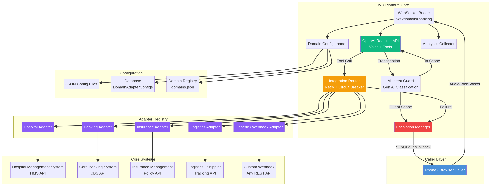
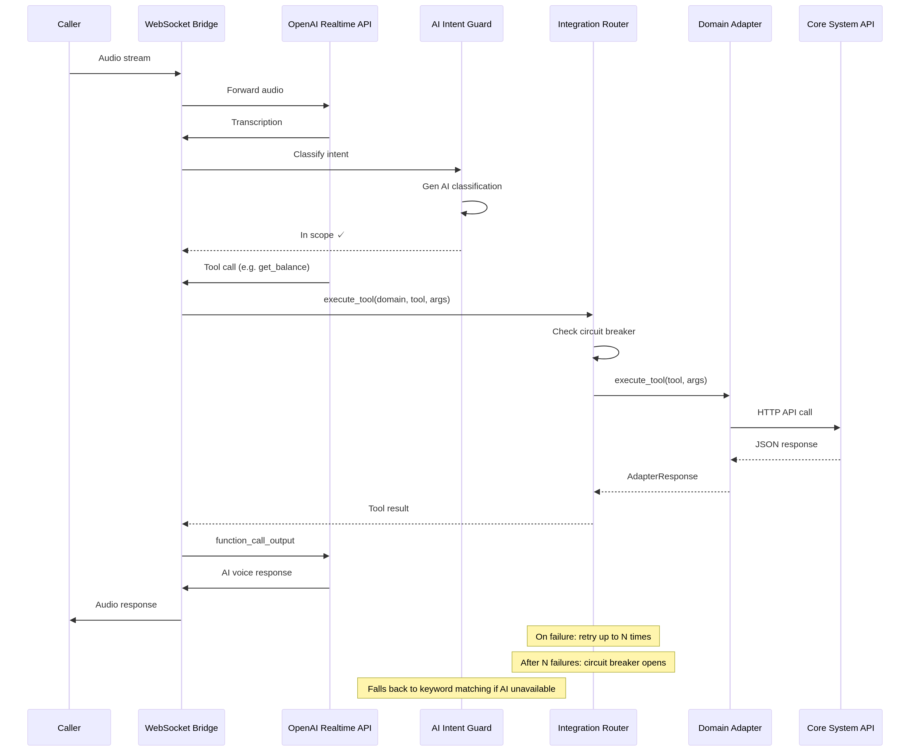

# Adapter Framework - Developer Guide

## Introduction

The Adapter Framework is the core enhancement to the Cloud IVR Platform. It decouples the IVR engine from domain-specific business logic, enabling the platform to connect to **any** backend core system through a standardized adapter interface. This document serves as the definitive guide for developers who need to understand, extend, or maintain the adapter system.

## Architecture Overview



The architecture follows a layered pattern where each layer has a single, well-defined responsibility. The **Caller Layer** handles audio I/O. The **IVR Platform Core** manages AI sessions, intent classification, and routing. The **Adapter Registry** holds domain-specific adapters. The **Core Systems** layer represents the external APIs that each adapter connects to.



## Directory Structure

```
server/app/adapters/
├── __init__.py                  # Public exports
├── base_adapter.py              # Abstract base class & data models
├── adapter_registry.py          # Dynamic adapter registration & caching
├── integration_router.py        # Routing, retry, circuit breaker
├── domain_config_loader.py      # Config loading from JSON/DB
├── hospital_adapter.py          # Hospital Management System adapter
├── banking_adapter.py           # Core Banking System adapter
├── insurance_adapter.py         # Insurance Management adapter
├── logistics_adapter.py         # Logistics/Shipping adapter
└── generic_adapter.py           # Webhook/fallback adapter
```

## Core Components

### BaseDomainAdapter

Every adapter extends `BaseDomainAdapter`. This abstract class defines the contract that all adapters must fulfill.

| Method | Purpose |
|---|---|
| `get_tool_definitions()` | Returns the list of tools this adapter exposes to the AI |
| `execute_tool(name, args)` | Executes a specific tool and returns an `AdapterResponse` |
| `authenticate()` | Handles authentication with the backend system |
| `health_check()` | Verifies the backend system is reachable |
| `get_openai_tools()` | Converts tool definitions to OpenAI function-calling format |

### AdapterConfig

A dataclass that holds all configuration for an adapter instance.

| Field | Type | Description |
|---|---|---|
| `domain_id` | `str` | Unique identifier for the domain |
| `adapter_type` | `str` | Which adapter class to use (hospital, banking, etc.) |
| `api_base_url` | `str` | Base URL of the core system API. Empty = demo mode |
| `api_key` | `str` | API key for authentication |
| `auth_type` | `str` | Authentication method: none, api_key, oauth2, basic |
| `custom_settings` | `dict` | Adapter-specific settings (webhook_url, etc.) |
| `timeout_seconds` | `int` | HTTP timeout for API calls |
| `max_retries` | `int` | Number of retry attempts on failure |

### AdapterResponse

A standardized response object returned by all adapters.

| Field | Type | Description |
|---|---|---|
| `ok` | `bool` | Whether the operation succeeded |
| `status` | `AdapterStatus` | Enum: success, error, not_found, timeout, unauthorized, escalate |
| `data` | `dict` | The response payload |
| `error` | `str` | Error message if `ok` is False |
| `message` | `str` | Human-readable message for the AI to speak |

### IntegrationRouter

The router sits between the WebSocket bridge and the adapters. It provides three critical features:

1.  **Retry Logic**: If an API call fails, the router retries up to `max_retries` times with exponential backoff.
2.  **Circuit Breaker**: After 5 consecutive failures, the circuit breaker "opens" and blocks further calls for 60 seconds, preventing cascading failures.
3.  **Audit Logging**: Every tool execution is logged with timing, arguments, and results.

## Creating a New Adapter

To add support for a new industry (e.g., Telecom), follow these steps:

### Step 1: Create the Adapter Class

```python
# server/app/adapters/telecom_adapter.py
from .base_adapter import (
    AdapterConfig, AdapterResponse, AdapterStatus,
    AdapterToolDefinition, BaseDomainAdapter,
)

class TelecomAdapter(BaseDomainAdapter):
    def get_tool_definitions(self):
        return [
            AdapterToolDefinition(
                name="check_balance",
                description="Check prepaid/postpaid balance.",
                parameters={...},
                handler_method="handle_check_balance",
            ),
        ]

    def execute_tool(self, tool_name, args):
        self.ensure_authenticated()
        return self._dispatch_tool(tool_name, args)

    def authenticate(self):
        self._authenticated = True
        return True

    def health_check(self):
        return AdapterResponse(ok=True, status=AdapterStatus.SUCCESS)

    def handle_check_balance(self, phone_number="", **kwargs):
        # Call your Telecom API here
        return AdapterResponse(ok=True, status=AdapterStatus.SUCCESS, data={...})
```

### Step 2: Register the Adapter

In `main_enhanced.py`, add one line:

```python
adapter_registry.register("telecom", TelecomAdapter)
```

### Step 3: Add Industry Mapping

In `domain_config_loader.py`, add:

```python
INDUSTRY_ADAPTER_MAP["telecom"] = "telecom"
```

### Step 4: Create a Config File (Optional)

```json
{
  "domain_id": "telecom-airtel",
  "adapter_type": "telecom",
  "organization_name": "Airtel",
  "api_base_url": "https://api.airtel.com",
  "auth_type": "api_key",
  "api_key": "your-api-key"
}
```

That is all. The new domain is now live and ready to handle calls.

## Adapter Modes

Every adapter supports two modes of operation, determined by the `api_base_url` configuration:

| Mode | Condition | Behavior |
|---|---|---|
| **Demo/Local** | `api_base_url` is empty | Returns realistic placeholder data. Ideal for development and testing. |
| **Production/API** | `api_base_url` is set | Makes real HTTP calls to the core system API. |

This dual-mode design means the entire platform can run in demo mode without any external dependencies, which is critical for development, testing, and sales demonstrations.

## Available Adapters

| Adapter | Industry | Tools | Demo Mode |
|---|---|---|---|
| HospitalAdapter | Healthcare | verify_patient, get_available_slots, book_appointment, get_appointment_status, get_lab_report_status, get_billing_info | Yes |
| BankingAdapter | Banking/Finance | verify_customer, get_account_balance, block_card, get_mini_statement, get_loan_status, initiate_fund_transfer, get_cheque_status | Yes |
| InsuranceAdapter | Insurance | verify_policyholder, get_policy_details, get_claim_status, get_premium_info, get_renewal_status | Yes |
| LogisticsAdapter | Logistics/Shipping | track_shipment, schedule_pickup, get_delivery_estimate, register_complaint, get_rate_estimate | Yes |
| GenericAdapter | Any | lookup_info, create_ticket, check_status, escalate_to_agent + custom webhook tools | Yes |

## GenericAdapter and Webhooks

The `GenericAdapter` is designed for organizations that want to connect their IVR without writing a custom adapter. It supports three modes:

1.  **Conversational**: Default mode. Returns helpful responses and creates tickets.
2.  **Webhook**: All tool calls are forwarded as POST requests to a configured `webhook_url`.
3.  **Custom**: Custom tool definitions loaded from config, forwarded to webhook.

This means any organization with a REST API can integrate with the IVR platform by simply configuring a webhook URL and defining their tools in JSON.

## Error Handling and Resilience

The adapter framework implements multiple layers of resilience:

1.  **Input Validation**: Adapters validate required parameters before making API calls.
2.  **Timeout Protection**: All HTTP calls have configurable timeouts (default 30s).
3.  **Retry with Backoff**: Failed calls are retried with increasing delays (0.5s, 1s, 1.5s...).
4.  **Circuit Breaker**: After 5 failures, the circuit opens for 60 seconds.
5.  **Graceful Degradation**: If the backend is down, the AI informs the caller and offers escalation.
6.  **Audit Trail**: Every tool execution is logged for debugging and compliance.
